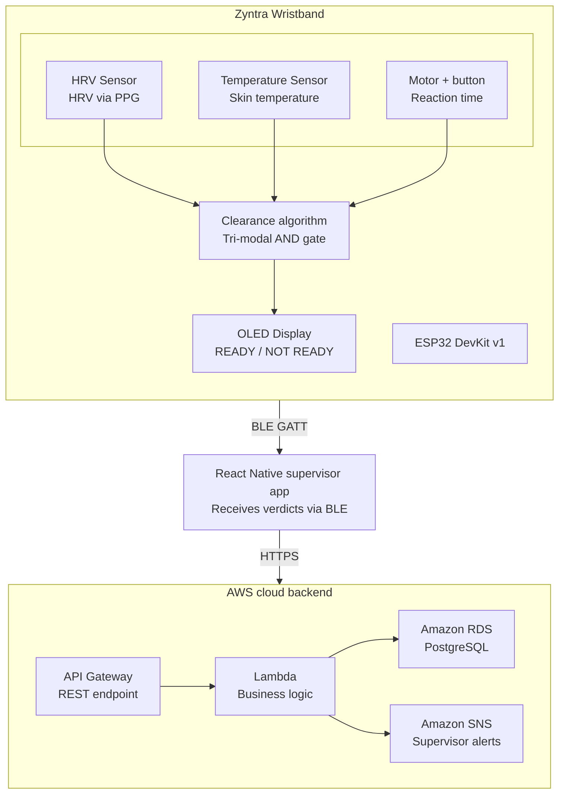

# Zyntra -- Post-Break Physiological Readiness Clearance System

**CS3283 - Embedded Systems Project | Semester 5 | University of Moratuwa**

**Zyntra** is an ESP32-based wristband that checks three body signals during a rest break and gives a reliable **READY / NOT READY** result before a worker goes back to a dangerous job. It helps replace guessing with accurate data.

##  The Problem

In dangerous jobs such as crane operation, scaffolding, electrical work, and heavy machinery operation, a small mistake caused by tiredness or poor physical condition can lead to serious injuries or even death.

Workers take required rest breaks after heavy work, heat exposure, near-miss accidents, or machine vibration. After the break, they return to their tasks. However, the important question is: *"Has this worker recovered enough and is ready to safely continue the job?"*

Currently this is answered by:
- **Fixed-time schedules** - 10 minutes for everyone, regardless of individual physiology
- **Self-assessment** - "I feel fine" : which is systematically unreliable


---

##  The Solution

A wrist-worn ESP32 device that monitors **three body recovery signals** during a rest break. It gives a **READY** clearance only when all three signals confirm that the worker has recovered, using an AND-gate decision logic.

```
          Break Starts
               │
               ▼
┌─────────────────────────────┐
│        CLEARANCE LOGIC      │
│  ┌─────┐  ┌──────┐  ┌────┐  │
│  │ HRV │  │ TEMP │  │ RT │  │  ← ALL THREE MUST PASS
│  └──┬──┘  └──┬───┘  └─┬──┘  │
└─────┼────────┼────────┼─────┘
      └────────┴────────┘
               │
     ┌─────────┴────────┐
     ▼                  ▼
  READY ✅         NOT READY ❌
                   (failed signal shown
                    + time estimate
                    + supervisor alert)
```


##  System Architecture


## Project Structure

```
Zyntra_Sem5/
│
├── src/                             # ESP32 firmware source files (PlatformIO)
│   ├── main.cpp                     # State machine + main loop
│   ├── hrv.cpp                      # PPG peak detection + RMSSD computation
│   ├── temperature.cpp              # MLX90614 sampling + baseline comparison
│   ├── reaction_test.cpp            # 5-stimulus RT micro-test delivery + timing
│   ├── clearance.cpp                # AND-gate clearance logic + time-to-clear estimate
│   ├── oled_display.cpp             # All four OLED screen layouts
│   └── ble_service.cpp              # BLE GATT server + JSON broadcast
│
├── include/                         # Header files
│   ├── config.h                     # All pin definitions and threshold constants
│   ├── hrv.h
│   ├── temperature.h
│   ├── reaction_test.h
│   ├── clearance.h
│   ├── oled_display.h
│   └── ble_service.h
│
├── lib/                             # Project-specific private libraries
│
├── ZyntraApp/                       # React Native supervisor mobile app
│   ├── src/
│   │   ├── services/
│   │   │   ├── BleService.js        # BLE scanning + connection + notify parsing
│   │   │   └── ApiService.js        # AWS API Gateway HTTPS calls
│   │   ├── screens/
│   │   │   ├── DashboardScreen.js   # All workers real-time status cards
│   │   │   ├── RecoveryScreen.js    # 3 live progress bars from BLE
│   │   │   ├── ClearanceScreen.js   # READY / NOT READY result
│   │   │   └── AuditLogScreen.js    # History + CSV export
│   │   └── models/
│   │       └── ClearanceEvent.js    # Data model for clearance events
│   ├── App.js                       # Root component + navigation
│   └── package.json
│
├── backend/                         # FastAPI Python backend (deployed to AWS Lambda)
│   ├── main.py                      # FastAPI app + Mangum Lambda handler
│   ├── models.py                    # PostgreSQL table models (SQLAlchemy)
│   ├── routes/
│   │   ├── workers.py               # POST /workers, GET /workers
│   │   ├── events.py                # POST /clearance-events, GET /events
│   │   └── analytics.py            # GET /events/summary
│   ├── database.py                  # RDS PostgreSQL connection
│   └── requirements.txt
│
├── database/                        # PostgreSQL schema and migrations
│   ├── schema.sql                   # Table definitions (workers, baselines, events)
│   └── seed.sql                     # Sample data for testing
│
├── validation/                      # Research validation scripts
│   ├── compute_metrics.py           # Sensitivity / specificity vs PVT ground truth
│   ├── recovery_analysis.py         # HRV + temp recovery curve analysis
│   └── data/                        # Collected session data (CSV)
│
├── docs/                            # Documentation
│   ├── architecture.md              # System architecture Mermaid diagram
│   ├── wiring_diagram.png           # Hardware wiring reference
│   └── component_list.md            # Full BOM with prices
│
├── platformio.ini                   # PlatformIO project configuration + library deps
└── README.md
```
