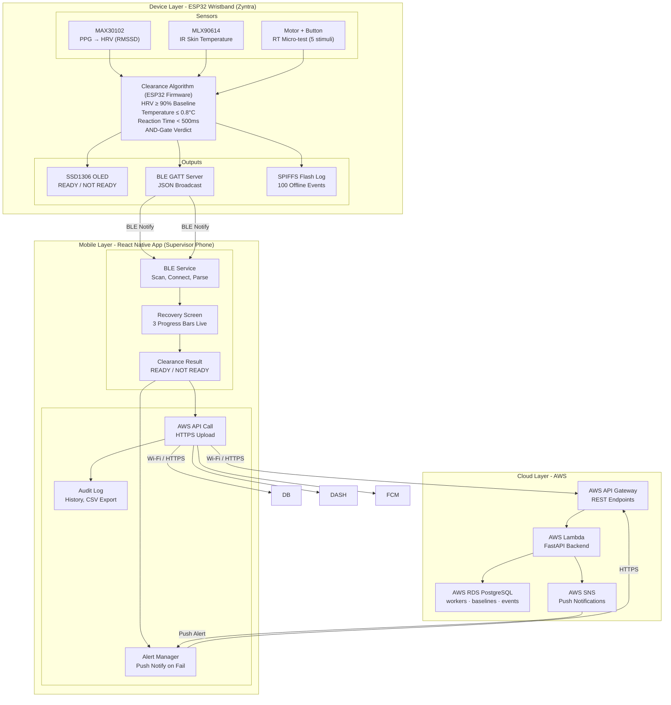

# Zyntra -- Post-Break Physiological Readiness Clearance System

**CS3283 - Embedded Systems Project | Semester 5 | University of Moratuwa**

**Zyntra** is an ESP32-based wristband that checks three body signals during a rest break and gives a reliable **READY / NOT READY** result before a worker goes back to a dangerous job. It helps replace guessing with accurate data.

##  The Problem

In dangerous jobs such as crane operation, scaffolding, electrical work, and heavy machinery operation, a small mistake caused by tiredness or poor physical condition can lead to serious injuries or even death.

Workers take required rest breaks after heavy work, heat exposure, near-miss accidents, or machine vibration. After the break, they return to their tasks. However, the important question is: *"Has this worker recovered enough and is ready to safely continue the job?"*

Currently this is answered by:
- **Fixed-time schedules** - 10 minutes for everyone, regardless of individual physiology
- **Self-assessment** - "I feel fine" : which is systematically unreliable


---

##  The Solution

A wrist-worn ESP32 device that monitors **three body recovery signals** during a rest break. It gives a **READY** clearance only when all three signals confirm that the worker has recovered, using an AND-gate decision logic.

```
          Break Starts
               │
               ▼
┌─────────────────────────────┐
│        CLEARANCE LOGIC      │
│  ┌─────┐  ┌──────┐  ┌────┐  │
│  │ HRV │  │ TEMP │  │ RT │  │  ← ALL THREE MUST PASS
│  └──┬──┘  └──┬───┘  └─┬──┘  │
└─────┼────────┼────────┼─────┘
      └────────┴────────┘
               │
     ┌─────────┴────────┐
     ▼                  ▼
  READY ✅         NOT READY ❌
                   (failed signal shown
                    + time estimate
                    + supervisor alert)
```


##  System Architecture

