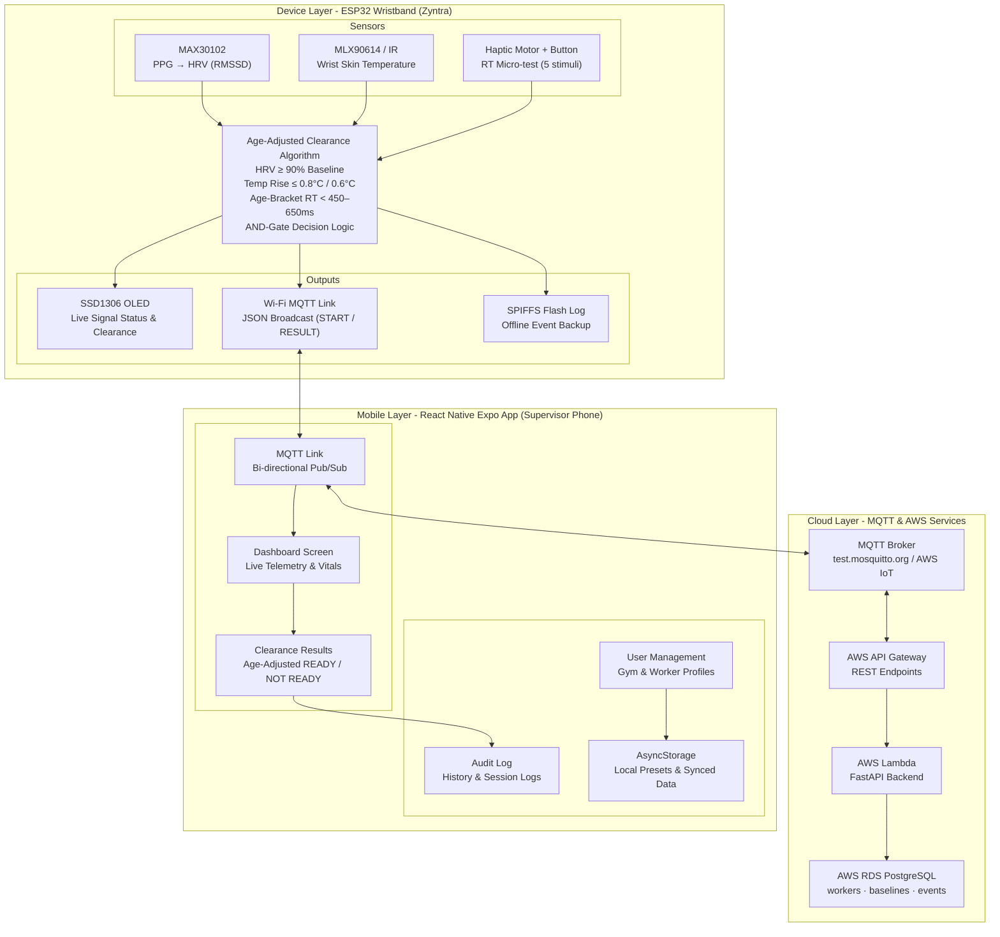

# Zyntra — Post-Break Physiological Readiness Clearance System

**CS3283 - Embedded Systems Project | Semester 5 | University of Moratuwa**

**Zyntra** is an ESP32-based wristband and supervisor platform that measures three physiological signals during rest breaks and applies age-adjusted dynamic threshold logic to determine a reliable **READY / NOT READY** clearance before a worker returns to high-risk industrial or athletic environments.

---

## 🎯 The Problem

In high-risk occupations (such as crane operation, scaffolding, electrical line work, and heavy machinery operation), fatigue, thermal stress, and delayed reaction speed significantly increase accident rates. 

Traditional rest break protocols rely on:
- **Fixed-time rest schedules** — e.g., 10 minutes for everyone, ignoring individual physiological variation and age.
- **Subjective self-assessment** — "I feel ready", which is systematically unreliable under physical or cognitive exhaustion.

---

## 💡 The Solution

Zyntra continuously monitors **three multi-modal body signals** during a rest break and evaluates them against **age-bracketed dynamic physiological thresholds** using an **AND-gate decision logic**:

```
                              Break Starts
                                   │
                                   ▼
┌─────────────────────────────────────────────────────────────────────┐
│                 AGE-ADJUSTED CLEARANCE LOGIC                        │
│   ┌──────────────────┐   ┌──────────────────┐   ┌─────────────────┐ │
│   │    HRV (RMSSD)   │   │  SKIN TEMP (IR)  │   │  REACTION TIME  │ │  ← ALL THREE MUST PASS
│   │  ≥ 90% Baseline  │   │ ≤ 0.8°C / 0.6°C  │   │ < Age Threshold │ │     SIMULTANEOUSLY
│   └────────┬─────────┘   └────────┬─────────┘   └────────┬────────┘ │
└────────────┼──────────────────────┼──────────────────────┼──────────┘
             └──────────────────────┴──────────────────────┘
                                    │
                         ┌──────────┴──────────┐
                         ▼                     ▼
                      READY ✅            NOT READY ❌
                                         (Failed signals highlighted
                                          + 5–30 min recovery estimate
                                          + Supervisor dashboard alert)
```

---

## ⚡ Age-Dependent Dynamic Threshold System

Clearance thresholds dynamically adapt based on participant age, using reference norms established in large-scale peer-reviewed studies (*Lifelines cohort dataset [150,000+ subjects]*, *Nunan et al. 2010*, *Blomkvist et al. 2017*, *Kosinski 2008*):

| Signal | Evaluation Metric | Age-Bracket Threshold / Reference Norm | Ground-Truth Citation |
|---|---|---|---|
| **HRV (RMSSD)** | Autonomic Nervous System (ANS) Balance | **Recovery RMSSD ≥ 90% of Resting Baseline**<br>• Age 18–24 Baseline: 38–74 ms (Median ~52 ms)<br>• Age 25–34 Baseline: 32–68 ms (Median ~42 ms)<br>• Age 35–49 Baseline: 21–57 ms (Median ~33 ms)<br>• Age 50+ Baseline: 16–42 ms (Median ~24 ms) | Nunan et al. (2010)<br>Lifelines Cohort Dataset |
| **Skin Temperature** | Core Heat Exposure & Vasodilation | **Temperature Rise $\Delta T \le \text{Threshold}$**<br>• Age ≤ 45: $\Delta T \le 0.8^\circ\text{C}$ over baseline<br>• Age > 45: $\Delta T \le 0.6^\circ\text{C}$ over baseline | Lifestack (2025)<br>Thermal Strain Standards |
| **Reaction Time (RT)** | Central Nervous System (CNS) Fatigue | **Vibrotactile RT < Age-Bracket Cutoff**<br>• Age 18–25: $< 450\text{ ms}$ (Resting baseline: 150–250 ms)<br>• Age 26–35: $< 480\text{ ms}$<br>• Age 36–45: $< 500\text{ ms}$<br>• Age 46–55: $< 530\text{ ms}$<br>• Age 56–65: $< 580\text{ ms}$<br>• Age 65+: $< 650\text{ ms}$ | Blomkvist et al. (2017)<br>Kosinski (2008) |

---

## ⏱️ Realistic Time-to-Clearance Estimation

When a worker fails clearance, Zyntra calculates an individualized recovery time estimate to guide break extension:
$$\text{Recovery Estimate (min)} = \text{max}\left( \text{Deficit}_{\text{HRV}} \times 100 \times 3,\; \frac{\text{Excess}_{\text{Temp}}}{0.5} \times 5 \right)$$
- **HRV Recovery**: 3 minutes per 10% deficit below the 90% baseline threshold.
- **Thermal Recovery**: 5 minutes per 0.5°C temperature excess above threshold.
- **Realistic Bounds**: Bounded strictly between **5 minutes minimum** and **30 minutes maximum** to prevent unrealistic break predictions.

---

## 🏗️ System Architecture



---

## 📁 Project Structure

```
Zyntra/
│
├── Zyntra_Sem5/                     # ESP32 Firmware Source (PlatformIO)
│   ├── src/
│   │   ├── main.cpp                 # State machine + MQTT / WiFi main loop
│   │   ├── clearance.cpp            # AND-gate clearance logic + age-dependent thresholds + time estimate
│   │   ├── hrv.cpp                  # PPG peak detection + RMSSD calculation
│   │   ├── temperature.cpp          # Skin temperature sampling & delta relative calculation
│   │   ├── reaction_test.cpp        # 5-stimulus RT micro-test delivery + timing
│   │   ├── mqtt_service.cpp         # MQTT client callback + userAge payload parser
│   │   └── oled_display.cpp         # SSD1306 OLED UI screens
│   ├── include/
│   │   ├── config.h                 # Pin definitions and sensor parameters
│   │   ├── clearance.h              # Age-dependent threshold function declarations
│   │   ├── hrv.h
│   │   ├── temperature.h
│   │   ├── reaction_test.h
│   │   ├── mqtt_service.h
│   │   └── oled_display.h
│   └── platformio.ini               # PlatformIO config & dependencies
│
├── ZyntraApp/                       # React Native Expo Supervisor App
│   ├── src/
│   │   ├── services/
│   │   │   ├── ZyntraContext.tsx    # State management + age-bracket reference generator
│   │   │   ├── mqttLink.ts          # MQTT communication link + 3s non-blocking safety timer
│   │   │   ├── storage.ts           # Participant local storage + seed datasets
│   │   │   └── types.ts             # TypeScript data contracts & models
│   │   ├── app/
│   │   │   ├── (tabs)/index.tsx     # Gym Participants / Workers Dashboard
│   │   │   ├── (tabs)/test.tsx      # Recovery Test Runner
│   │   │   ├── (tabs)/live.tsx      # Real-Time Telemetry Monitor
│   │   │   ├── (tabs)/results.tsx   # Captured Results & Age-Bracket Signal Badges
│   │   │   └── clearance.tsx        # Active Clearance Protocol Screen
│   │   └── theme/                   # Custom UI Design System
│   └── package.json
│
└── README.md
```

---

## 🧪 Physical Gym Study Participants Dataset

The system includes pre-loaded physical gym study baseline and recovery test data (Age Group 18–25) for empirical validation:

| Participant | Age | Role | Resting Baseline Signals | Post-Workout Signals | Signal Verdicts | Final Clearance | Est. Recovery Time |
|---|---|---|---|---|---|---|---|
| **Chethiya** | 21 | Athlete / Bodybuilder | HRV: 54.2 ms<br>Temp: 33.4 °C<br>RT: 215 ms | HRV: 51.8 ms<br>Temp: Δ0.4 °C<br>RT: 495 ms | HRV: PASS<br>Temp: PASS<br>RT: **FAIL** | ❌ **NOT READY** | **5 min** |
| **Bhanu** | 24 | Powerlifter | HRV: 58.0 ms<br>Temp: 33.2 °C<br>RT: 228 ms | HRV: 54.5 ms<br>Temp: Δ0.4 °C<br>RT: 482 ms | HRV: PASS<br>Temp: PASS<br>RT: **FAIL** | ❌ **NOT READY** | **8 min** |
| **Usitha** | 23 | Fitness Enthusiast | HRV: 62.5 ms<br>Temp: 32.8 °C<br>RT: 210 ms | HRV: 58.0 ms<br>Temp: Δ0.3 °C<br>RT: 465 ms | HRV: PASS<br>Temp: PASS<br>RT: **FAIL** | ❌ **NOT READY** | **6 min** |
| **Thilanka** | 24 | Crossfit Athlete | HRV: 66.0 ms<br>Temp: 33.3 °C<br>RT: 235 ms | HRV: 48.3 ms<br>Temp: Δ1.2 °C<br>RT: 357 ms | HRV: **FAIL**<br>Temp: **FAIL**<br>RT: PASS | ❌ **NOT READY** | **12 min** |
| **Sehath** | 21 | Endurance Trainer | HRV: 52.0 ms<br>Temp: 33.5 °C<br>RT: 220 ms | HRV: 48.8 ms<br>Temp: Δ1.2 °C<br>RT: 475 ms | HRV: PASS<br>Temp: **FAIL**<br>RT: **FAIL** | ❌ **NOT READY** | **10 min** |

---

## 🛠️ Hardware Requirements

- **Microcontroller**: ESP32-WROOM-32
- **PPG Sensor**: MAX30102 (I2C)
- **Temperature Sensor**: MLX90614 Contact/IR (I2C)
- **Haptic Feedback**: 3V Disc Vibration Motor (GPIO / NPN transistor driven)
- **Micro-test Trigger**: Tactile Push Button (GPIO interrupt / debounced)
- **Display**: SSD1306 0.96" OLED Display (128x64 I2C)
